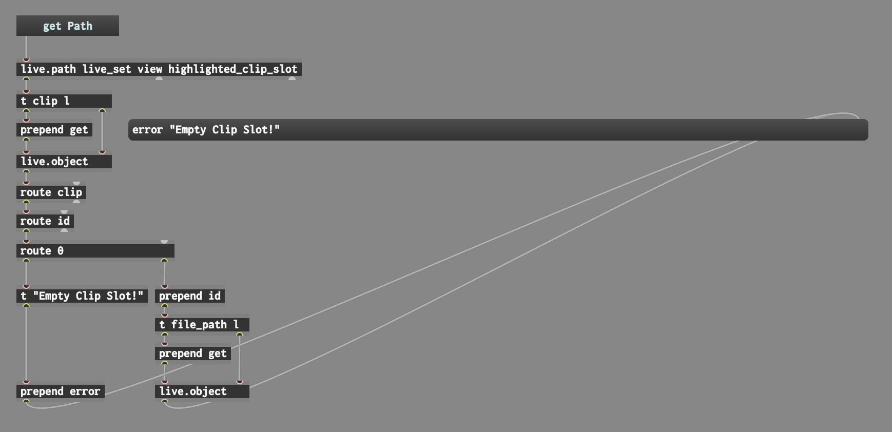
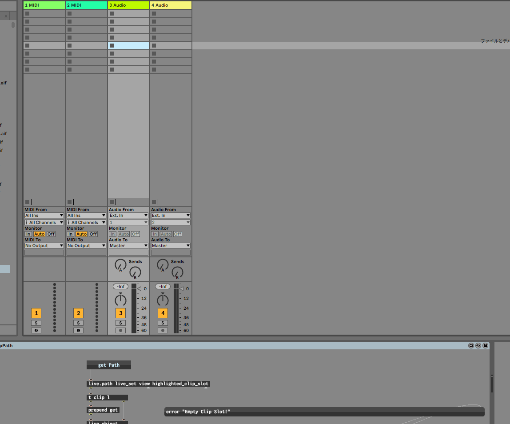

# オーディオクリップのパスを取得する

## サンプル

## 解説

* `live.path live_set view highlighted_clip_slot`
    * 選択されているクリップスロットへの `id` を取得する
    * 例 : `id 100`
* `t clip l`
    1. 右から `live.object` の右インレットへ取得した `id` を送る
    2. 左から `clip` というメッセージを送る
* `prepend get`
    * 送られてきた `clip` というメッセージの先頭に `get` をつける
    * 結果、 `get clip` というメッセージになる
    * `get clip` メッセージは `id` が送られた `live.object` の左インレットに送られる
* `live.object` 
    * 指定された `id` に対して `get clip` メッセージを実行する
    * 成功したら取得した `clip` の `id` が左アウトレットから出力される
        * 例 : `clip id 74`
    * 失敗したら `0` の `id` が出てくる
        * 例 : `clip id 0`
* `route clip`
    * `live.object` の出力の内、`clip` で始まるものを左アウトレットから出力する
    * `clip id 74` の場合、 左アウトレットから `id 74` が出力される
* `route id`
    * 同様に、 `id` で始まるメッセージを左アウトレットから出力する
    * `id 74` の場合 `74` が出力される
* `route 0`
    * 同様に、 `0` から始まるメッセージを左側から出力する
    * `0` というメッセージから `0` を取り除くと何も残らないが、何もない場合は `bang` というメッセージが出力される
    * ここで失敗の時は左、成功の時は右と分けている
    * `0` 以外の値が入力された場合は右側から出力される

### 失敗時(左側)

* `t "Empty Clip Slot!"`
    * `Empty Clip Slot!` というメッセージを次のオブジェクトに送っている
* ` prepend error`
    * 送られてきた `Empty Clip Slot!` というメッセージの前に `error` というメッセージを追加する
    * 結果、 `error Empty Clip Slot!` というメッセージを次のオブジェクトに送っている

### 成功時(右側)

* `prepend id`
    * 送られてきた数字のメッセージに、先程取り除いた `id` を再び追加している
    * `74` というメッセージが送られてきた場合、 `id 74` になる
* `t file_path l`
    1. 右からもう1つの `live.object` 右インレットへ取得した `id` を送る
    2. 左から `file_path` というメッセージを送る
* `prepend get`
    * 送られてきた `file_path` というメッセージの先頭に `get` というメッセージをつける
    * 結果 `get file_path` というメッセージになる
    * `get file_path` メッセージは `id` が送られたもうひとつの `live.object` の左インレットに送られる
* `live.object` 
    * 指定された `id` に対して `get file_path` メッセージを実行する
    * 成功したら取得したファイルパスが左アウトレットから出力される
        * 例 : `/Users/TestUser/Music/example.mp3`

### 結果出力

* `message`
    * 右インレットに入力された値がメッセージボックス内に反映されるのを利用している